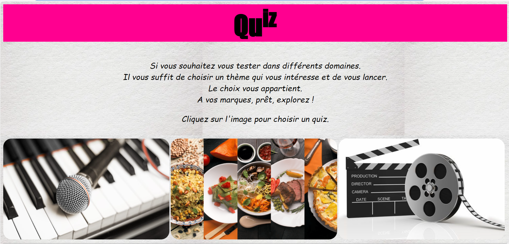
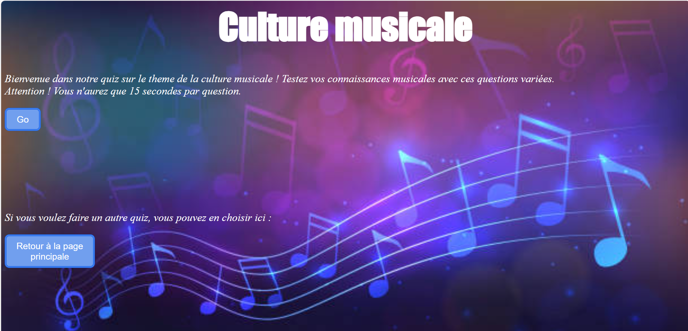
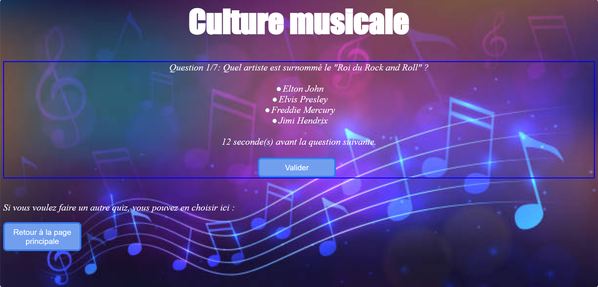
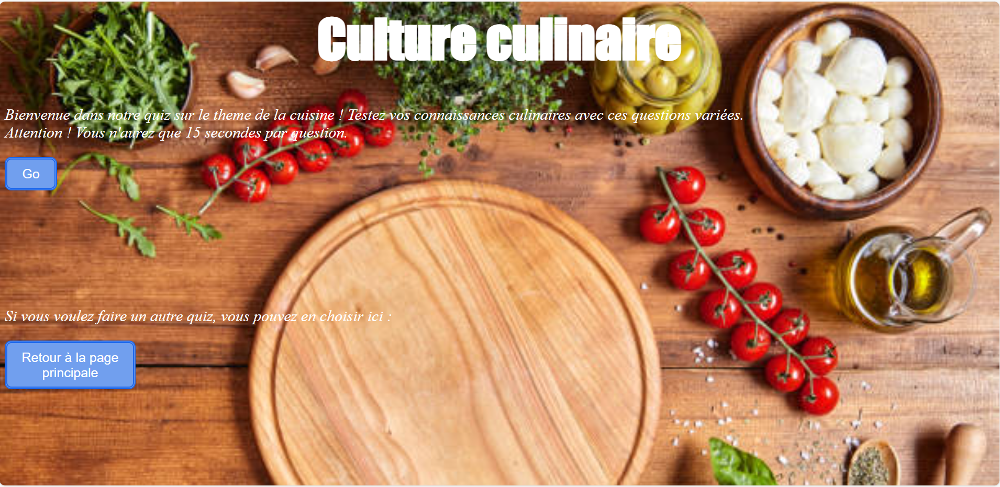
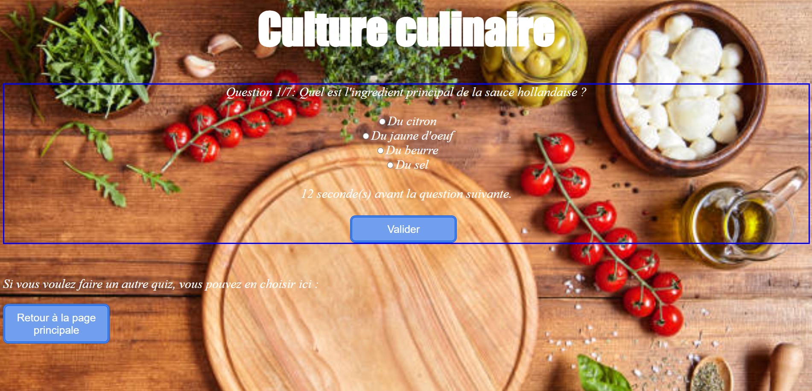
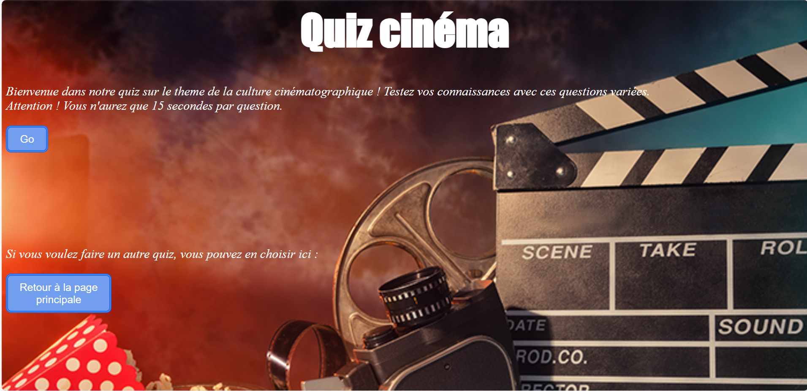
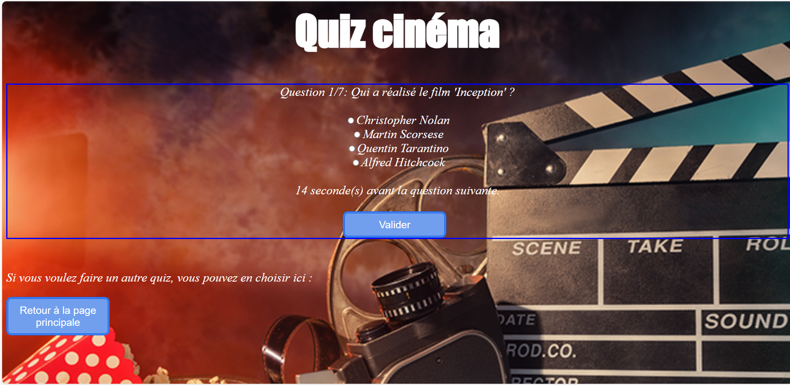

# Mon premier projet "quiz interactif (chant, cuisine, cinéma)" 

Ce projet consiste en la création d'un quiz interactif sur trois thèmes captivants : le chant, la cuisine et le cinéma. 
Il a été conçu pour mettre en pratique les bases du développement HTML tout en proposant un exemple concret et accessible
pour les débutants souhaitant apprendre et s'inspirer.

## Description du projet 
Dans ce projet, j'ai mis en œuvre :

### Trois pages HTML :

Une page principale (index.html) qui sert de point d'entrée au site web.

* Trois pages secondaires dédiées aux thèmes : le chant, la cuisine et le cinéma. (chant.html /cuisine.html /cinéma.html)

* Un fichier CSS : utilisé pour styliser l'ensemble des pages HTML et leur offrir une apparence cohérente et agréable.

* Un fichier JavaScript : chargé d'ajouter des interactions dynamiques et d'améliorer l'expérience utilisateur.
Ce projet illustre une organisation claire des fichiers et démontre l'application des bases de HTML, CSS et JavaScript.

## Aperçu  
Voici un aperçu des pages du projet :
### Page principale  (index.html)
  
### Première page secondaire: Chant
  
  
### Deuxième page secondaire: Cuisine
  
  
### Troisième page secondaire: Cinéma 
  
  

## Licence
Ce projet est sous licence [MIT](LICENSE).

## Lien de Démo
[Voir la démo](https://cherifa2001.github.io/My-first-HTML-page/)

